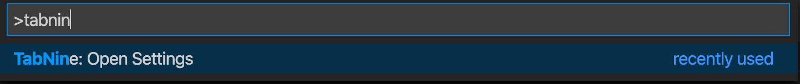
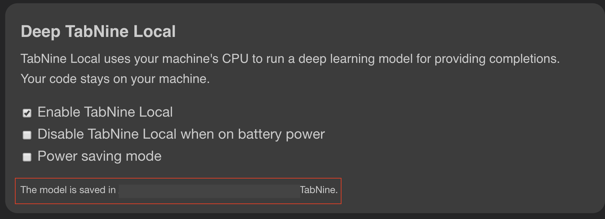
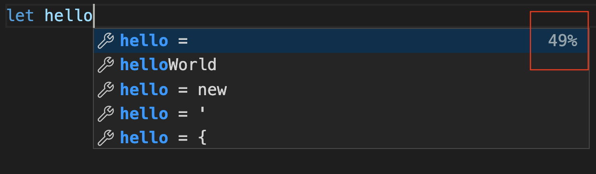

## **TabNine For Visual Studio Code**

[twitter-shield]: https://img.shields.io/twitter/follow/TabNineInc?style=social
[twitter-url]: http://bit.ly/2UmL69Q
[github-shield]: https://img.shields.io/github/stars/codota/tabnine-vscode?style=social
[github-url]: http://bit.ly/3niJTfW
[vscode-shield]: https://img.shields.io/visual-studio-marketplace/r/TabNine.tabnine-vscode?logo=visual-studio-code&style=social
[vscode-url]: http://bit.ly/3pqj7o2
[youtube-shield]: https://img.shields.io/youtube/views/TKLkXh_c-Gw?style=social
[youtube-url]: http://bit.ly/36slY7c

[![Github Repo][github-shield]][github-url]
[![Twitter Follow][twitter-shield]][twitter-url]
[![VSCode Plugin][vscode-shield]][vscode-url]
[![Youtube Demo Video][youtube-shield]][youtube-url]

### **TabNine Overview:**

---

This is the Visual Studio Code [TabNine](https://tabnine.com) client, advanced AI based autocomplete for all programming languages. TabNine Indexes your entire project by reading your `.gitignore` [or others](https://www.tabnine.com/faq#nongit), and determines which files to index.

- Enter long variable names using minimal keystrokes and leverage a mnemonic completion engine.
- Zero configuration. TabNine works out of the box.
- Highly responsive: Produces a list of suggestions in less than 10 milliseconds on average.

TabNine is part of [Codota](https://www.codota.com/)

### **Usage:**

---

The following is a brief guide to using TabNine in Visual studio Code.
First, install TabNine. Second, navigate to the TabNine Settings page, It can be accessed via the _TabNine: Open Settings_ command from the [Command Palette](https://code.visualstudio.com/docs/getstarted/userinterface#_command-palette) (Ctrl+Shift+P).

and verify that TabNine local model is successfully loaded, as shown in the following screenshot:

TabNine is a textual autocomplete extension. When you type a specific string in your editor, you will view TabNine completion dialog, with TabNine suggestions according to the text you type

Many users choose to disable the default behavior of using Enter to accept completions,
to avoid accepting a completion when they intended to start a new line.
You can do this by going to _Settings → Editor: Accept Suggestion On Enter_
and setting it to _off_.

### **Deep Completion:**

---

[Deep TabNine](https://www.tabnine.com/blog/local/) is trained on around 2 million files from GitHub. During training,
TabNine’s goal is to predict the next token given the tokens that came before.
To achieve this goal, TabNine learns complex behaviour, such as type inference
in dynamically typed languages.

Deep TabNine can use subtle clues that are difficult for traditional tools to access. For example,  
the return type of `app.get_user()`is assumed to be an object
with setter methods, while the return type of `app.get_users()` is assumed to be a list.

Deep TabNine is based on GPT-2, which uses the Transformer network architecture. This architecture was first developed to solve problems in natural language processing. Although modelling code and modelling natural language might appear to be unrelated tasks, modelling code requires understanding English in some unexpected ways.

### **TabNine Deep Cloud:**

---

TabNine requires consumption of memory resources when being run locally on your computer. It may incur some latency that is not optimal to all PC’s. With that in mind, TabNine has developed a Cloud solution, called TabNine Deep Cloud.

We understand that users concerned with their privacy prefer to keep their code on their own machine. Rest assured that we’re taking the following steps to address this concern:
For individual developers, we are working on a reduced-size model which can run on a laptop with reasonable latency. Update: we’ve released TabNine Local.
For enterprise users, we will soon roll-out the option to license the model and run it on your own hardware. We can also train a custom model for you which understands the unique patterns and style within your codebase. If this could be relevant to you or your team, we would love to hear more about your use case at enterprise@tabnine.com.
Enabling TabNine Deep Cloud sends small parts of your code to our servers to provide GPU-accelerated completions.
Other than for the purpose of fulfilling your query, your data isn’t used, saved or logged in any way.

**[You can enable TabNine Deep Cloud for free by signing up TabNine Professional](https://www.tabnine.com/trial/)**

**[You can read more about Deep Completion](https://www.tabnine.com/blog/deep)**

### **Frequently Asked Questions:**

---

Is TabNine simple to use?

TabNine works for all programming languages.
TabNine does not require any configuration in order to work.
TabNine does not require any external software (though it can integrate with it).
Since TabNine does not parse your code, it will never stop working because of a mismatched bracket.

Will TabNine leak my source code?

By default, TabNine makes web requests only for the purposes of downloading updates and validating registration keys. In this case your code is not sent anywhere, even to TabNine servers.
You may opt in to TabNine Deep Cloud, which allows you to use TabNine’s servers for GPU-accelerated completions powered by a deep learning model. If sending code to a cloud service is not possible, we also offer a self-hosted option. 
Contact us at enterprise@tabnine.com.

### **Note:**

---

A note on licensing: this repo includes source code as well as packaged TabNine binaries. The MIT license only applies to the source code, not the binaries. The binaries are covered by the [TabNine End User License Agreement](https://tabnine.com/eula).
