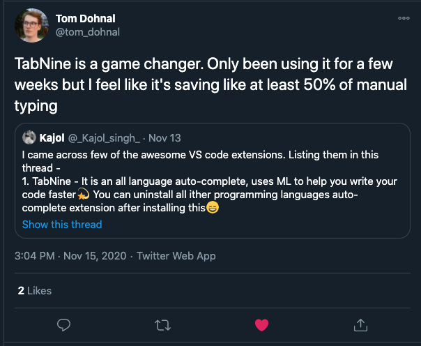
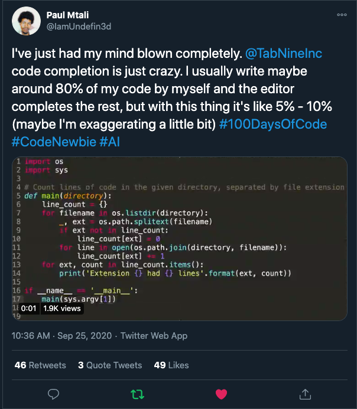
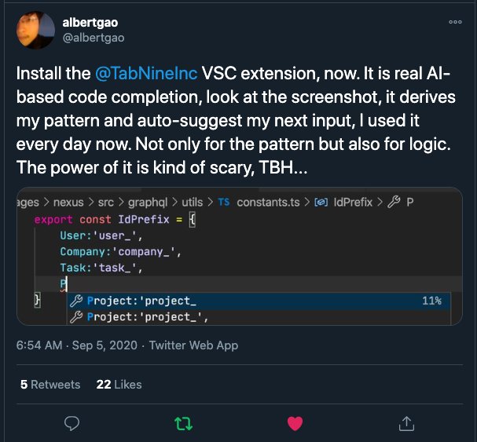
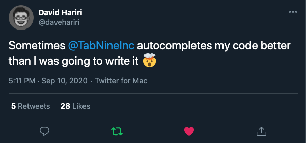
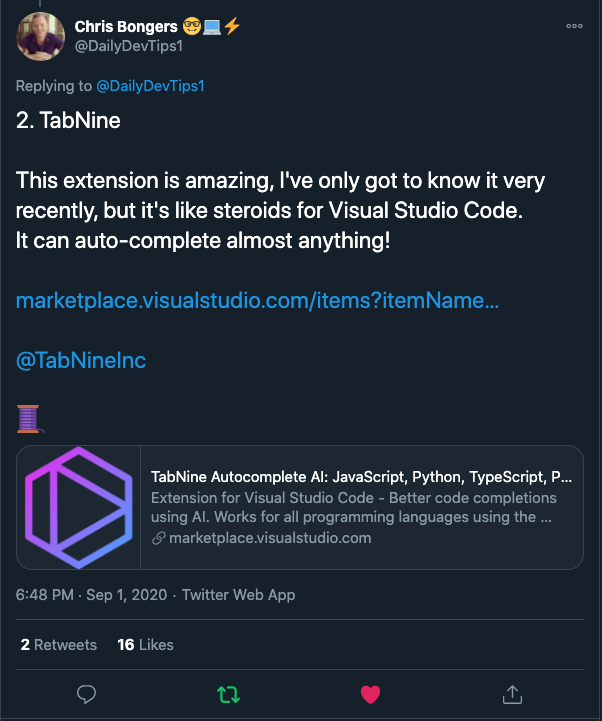
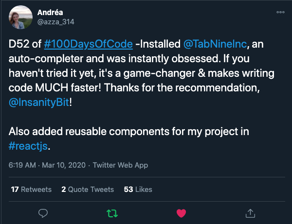
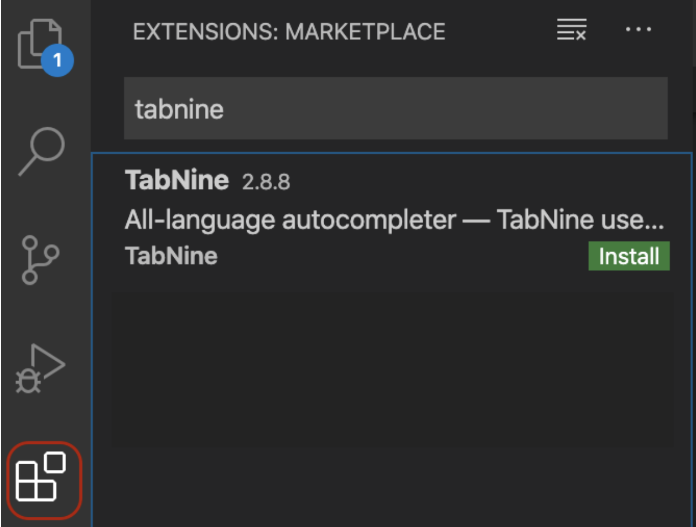

[twitter-shield]: https://img.shields.io/twitter/follow/TabNineInc?style=social
[twitter-url]: https://bit.ly/2UmL69Q
[github-shield]: https://img.shields.io/github/stars/codota/Tabnine?style=social
[github-url]: https://bit.ly/36iGtUU
[vscode-shield]: https://img.shields.io/visual-studio-marketplace/r/TabNine.tabnine-vscode?logo=visual-studio-code&style=social
[vscode-url]: https://bit.ly/3pqj7o2
[youtube-shield]: https://img.shields.io/youtube/views/TKLkXh_c-Gw?style=social
[youtube-url]: https://bit.ly/36slY7c

[![Github Repo][github-shield]][github-url]
[![VSCode Plugin][vscode-shield]][vscode-url]
[![Youtube Demo Video][youtube-shield]][youtube-url]
[![Twitter Follow][twitter-shield]][twitter-url]

### **Tabnine Overview:**
​
Tabnine is a powerful Artificial Intelligence assistant designed to help you code faster, reduce mistakes, and discover best coding practices - without ever leaving the comfort of VSCode. 
​
Tabnine studies publicly shared code and use A.I deep learning algorithms that provide us with the ability to predict your next coding needs and suggest one-click code completion. 
​
Tabnine works with all major programming languages such as JavaScript, Python, TypeScript, PHP, C/C++, HTML/CSS, Go, Java, Ruby, C#, Rust, SQL, Bash, Kotlin, Julia, Lua, OCaml, Perl, Haskell, and React.
​
We believe that coding is like Lego: Imagination is your only limit. 
We’re here to help provide you with the perfect code building blocks at the right time
​
No more memorizing coding syntax, no more worrying about typos, no more neglecting to add that crucial comma, or even search for coding solutions online. Start reducing your development costs, deliver reliable code faster, and explore best coding practices.
​
Tabnine is trusted by more than a million developers worldwide. [Join us Now](https://www.tabnine.com/install) and enjoy the coding future, today. It’s Free!
​

​
**Privacy**
​
Concerned about privacy and security? So do we! 
​
Your code’s privacy is our highest priority. Tabnine keeps your code completely private. 
​
Tabnine offers code completion suggestions based on a model trained on millions of open-source Java programs, which are then modified based on the code you are currently working with. Tabnine only sends minimal contextual information from your currently edited file that allows us to make predictions based on your current local scope.
​
We do not use your code to train our models and the information sent to our servers is only used to compute your prediction and is not being saved on our end.
​
Find out more about how we keep your code private [here](https://www.codota.com/tabnine-code-privacy)
​
***Recommended by developers everywhere:***
​

​

​

​

​

​

​
**Installation Instructions**
- Navigate to the Extensions tab and search for the Tabnine extension
​
- Click the Install button on the right-hand side
​
- Reload or Restart your VSCode
​

​

​
- The default behavior of Tabnine is using the Enter key to accept completions. 
If you want to use the Enter key to start a new line instead of accepting a completion, just go to ‘Settings → Editor: Accept Suggestion On Enter’ and turn it off.
​
**Manual Installation inside VSCode**
​
- Press Cmd+P in your Visual Studio Code, type in ext install Tabnine.tabnine-vscode and press Enter.
​
- Click the Reload button in the extensions tab.
​
- The default behavior of Tabnine is using the Enter key to accept completions. If you want to use the Enter key to start a new line instead of accepting a completion, just go to ‘Settings → Editor: Accept Suggestion On Enter’ and turn it off.
 
Trouble installing? Check out our [FAQ](https://www.tabnine.com/faq) page, or contact support@tabnine.com
​
***Tabnine Premium plans***
​
**Tabnine Pro**
​
Looking for an even greater productivity boost?
​
Tabnine Pro plan enables a larger index size, premium support, and optional use of GPU-accelerated cloud servers for Deep completions, providing even better predictions.
​
Click [Here](https://www.tabnine.com/trial) to get Free Tabnine Pro trial for 14 days
​
**Tabnine Enterprise**
​
Tabnine offers an enterprise-level solution with a Self-Hosting option and Specialized modules built specifically for your coding needs.
​
Want to learn more? [Contact us](mailto:enterprise@tabnine.com)
​
**Technical information**
​
Tabnine Indexes your entire project by reading your .gitignore or others and determines which files to index.
- Add long variable names using minimal keystrokes
- Zero configuration. Tabnine works out of the box
- Highly responsive: Produces a list of suggestions in less than 10 milliseconds on average.
​
**Usage**
​
After Tabnine’s installation, navigate to the Tabnine Settings page (‘TabNine: Open Settings’ from the [Command Palette](https://code.visualstudio.com/docs/getstarted/userinterface#_command-palette)) and verify that Tabnine local model is successfully loaded (as shown in the following screenshots)
​
Tabnine is a textual autocomplete extension. When you type a specific string in your editor, you will view Tabnine completion dialog, with Tabnine suggestions according to the text you type
​
**Deep Completion**
​
Deep Tabnine is trained on millions of files from GitHub. During training, Tabnine’s goal is to predict the next token given the tokens that came before. To achieve this goal, Tabnine learns complex behavior, such as type inference in dynamically typed languages.
​
Deep Tabnine can use subtle clues that are difficult for traditional tools to access. For example,
the return type of app.get_user()is assumed to be an object with setter methods, while the return type of app.get_users() is assumed to be a list.
​
Deep Tabnine is based on GPT-2, which uses the Transformers Network Architecture. This architecture was first developed to solve problems in natural language processing. Although modeling code and modeling natural language might appear to be unrelated tasks, modeling code requires understanding English in some unexpected ways.
